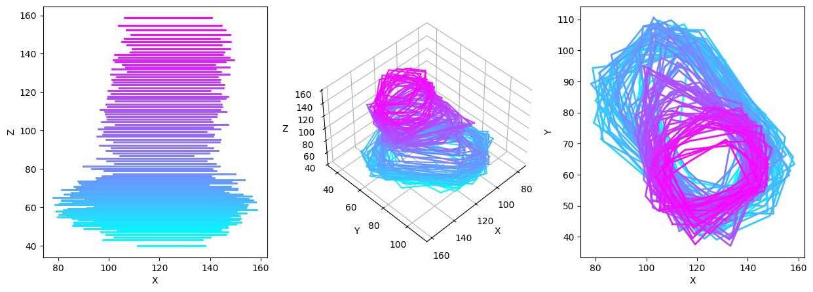

### small tools for calculating protein geometries



`calculate-slice-areas.py` creates `n` slices in z, then calculates a [convex hull](https://docs.scipy.org/doc/scipy/reference/generated/scipy.spatial.ConvexHull.html) on each of them, returning the area per slice, per frame.

`calculate-slice-distances.py` creates `n` slices in z, then calculates the average distance of each atom/bead/particle of the protein in that slice from the protein center of mass (in that same slice).

### Install:
```
git clone git@github.com:MoMS-MMSB/protein-geometry.git
cd protein-geometry
uv venv
source .venv/bin/activate
uv pip install -e .
```

### Usage:
#### Calculation by slices

```
python calculate-slice-{areas/distances}.py -s ${structure.gro/.tpr} -t ${trajectory.xtc/.trr} -n 100
```
where `-n` is the number of slices (default 50), `-o` specifies the names of the resulting `.png` and `.csv` files.
#### Calculation by voxels
```
python calculate-voxel-{areas/distances}.py -s ${structure.gro/.tpr} -t ${trajectory.xtc/.trr} -v 3
```
where `-v` is the voxel length in angstrom (default 3), `-o` specifies the names of the resulting `.png` and `.csv` files.
